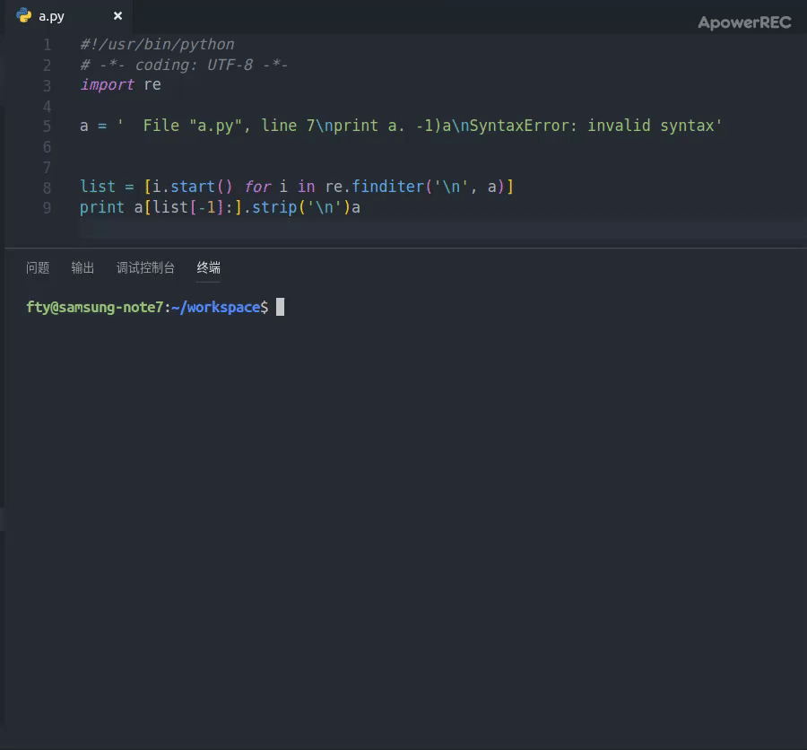

# SEO

## SEO是什么？

seo是一个Linux终端命令行工具，用于在编译文件报错时为你提供解决方案，实现更方便的面向搜索引擎编程 ：)

灵感来自于 [shobrook/rebound](https://github.com/shobrook/rebound)

觉得挺有意思，就自己整了个国内低配版，后续可能会进一步升级(~~看心情~~)

## 功能

### 语言支持

- [x] python2.7
- [x] C
- [x] JAVA

### 论坛支持

- [x] CSDN
- [x] segmentfual
- [ ] 知乎

### 界面
- [x] 搭建终端用户界面---[go_seo.py](https://github.com/CANYOUFINDIT/SEO/blob/master/go_seo.py)

### 内容

- [ ] 文章/回答内容筛选排序

## 效果图

